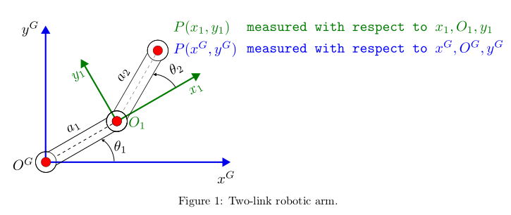

# Homogeneous Transformation Matrix

Homogeneous transformation matrix (Rotation + Translation) applied to a Two-link robotic arm

# Problem

Figure 1 shows a two-link robotic arm for which the second joint P (x1 , y1 )
is measured with respect to the x1 , O1 , y1 coordinate frame. Your goal is to
find P (xG , y G ), this is the coordinate of the second joint measured with
respect to the global coordinate frame xG , OG , y G 



# Requirements

1. If a1 = 4cm, a2 = 4cm, θ1 = 30o and θ2 = 30o :
    - Find T1G : This is the homogeneous 3x3 transformation matrix that maps the joint P (x1 , y1 ), measured with respect to the x1 , O1 , y1 , to P (xG , y G )
    -  Find P (xG , y G )

2. If a1 = 4cm, a2 = 4cm, θ1 = 30o and θ2 = 45o :
    -  Find T1G : This is the homogeneous 3x3 transformation matrix that maps the joint P (x1 , y1 ), measured with respect to the x1 , O1 , y1 , to P (xG , y G )
    -  Find P (xG , y G )

3.  Write a Python script that allows the user to enter a1 , a2 , θ1 and θ2
    from the Linux terminal and outputs P (xG , y G ). Notice that a1 and a2
    are entered in metres using the flag --a 0.04 0.04. The same applies for
    the rotation angles θ1 and θ2 , which are entered in degrees as --theta 30
    30 or --theta 30 45

```bash
python find-global-coordinate.py --a 0.04 0.04 --theta 30 30
<output> P(x_G, y_G) = [0.05464102, 0.05464102]

python find-global-coordinate.py --a 0.04 0.04 --theta 30 45
<output> P(x_G, y_G) = [0.04499378, 0.05863703]
```
